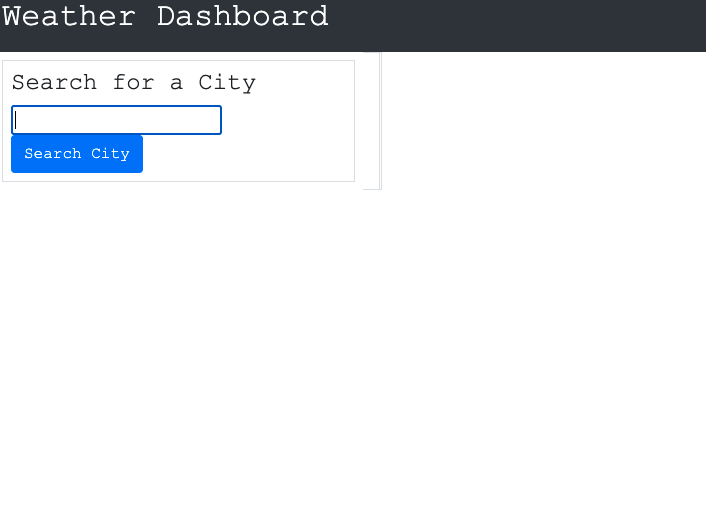
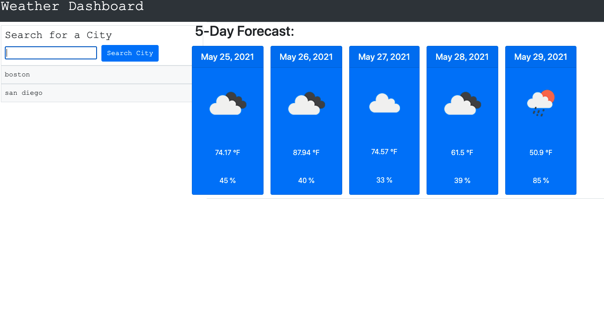

# weather-app

 
  # Description
  
  Developers are often tasked with retrieving data from another application's API and using it in the context of their own. Third-party APIs allow developers to access their data and functionality by making requests with specific parameters to a URL. Your challenge is to build a weather dashboard that will run in the browser and feature dynamically updated HTML and CSS.
Use the OpenWeather API to retrieve weather data for cities. The documentation includes a section called "How to start" that will provide basic setup and usage instructions. Use localStorage to store any persistent data.

  # Table of Contents 
  * [Installation](#installation)
  * [Usage](#usage)
  * [License](#license)
  * [Contributing](#contributing)
  * [Tests](#tests)
  * [Questions](#questions)
  # Installation
  The following necessary dependencies must be installed to run the application properly: 

  Git Clone this repo 

  # Usage
  ​
  You can see the forecast for any city you will like

  # License
  This project is license under the Microsoft Public License license.

  
  
  
  # Questions
  If you have any questions about the repo, open an issue or contact undefined directly .

  GitHub: @malcan09
  Email : malcantar185@gmail.com